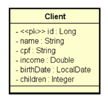

# Sobre o desafio

Deve-se entregar um projeto Spring Boot contendo um CRUD completo de web services REST para acessar um recurso de clientes, contendo as cinco operações básicas aprendidas no capítulo:

- Busca paginada de recursos 
- Busca de recurso por id 
- Inserir novo recurso 
- Atualizar recurso 
- Deletar recurso

Além disso, o projeto deverá estar com um ambiente de testes configurado acessando o banco de dados H2, deverá usar Maven como gerenciador de dependência, e Java como linguagem.

## Modelo conceitual

Um cliente possui nome, CPF, renda, data de nascimento, e quantidade de filhos. A especificação da entidade Client é mostrada a seguir (deve ser seguido à risca os nomes de classe e atributos mostrados no diagrama):



## Requisitos

Seu projeto deverá tratar as seguintes exceções:

- Id não encontrado (para GET por id, PUT e DELETE), retornando código 404. 
- Erro de validação, retornando código 422 e mensagens customizada para cada campo inválido. As regras de validação são:
  - Nome: não pode ser vazio
  - Data de nascimento: não pode ser data futura

## Créditos

Este desafio faz parte do curso **Java Spring Professional** da **Devsuperior**, ministrado pelo Prof. Dr. **Nélio Alves**, que visa trabalhar:

- Implementação de operações de CRUD
- Tratamento de exceções
- Customização de respostas HTTP
- Validação de dados com Bean Validation

## Como executar o desafio

*Pré-requisitos*:

- Tecnologias: Java 21, Maven 3
- Programas:
    - Terminal → para clonar e executar o projeto
      - ex.: Git Bash, Windows PowerShell, Prompt de comandos do Windows
    - (opcional) IDE ou editor de texto
      - ex.: Intellij IDEA, VS Code
    - Navegador web → para checar seeding da base de dados com H2
    - Postman → para testar as requisições de recursos

---

Abra um terminal de sua preferência, como o Git Bash, e execute os comandos a seguir:

````
# clonar repositório (via HTTPS)
git clone https://github.com/jonatasmateus/bds-java-spring-desafio-3

# entrar na pasta do desafio
cd bds-java-spring-desafio-3

# executar o projeto
./mvnw spring-boot:run
````

---

Caso tenha e opte por usar alguma IDE ou editor de texto instalado, certifique-se de ter o projeto clonado e execute o projeto dentro da IDE ou editor de texto.

### Para checar o seeding da base de dados

Abra um navegador web de sua preferência, digite a seguinte URL `http://localhost:8080/h2-console/`, logue o banco H2 conforme as especificações do arquivo application-test.properties e clique na tabela `tb_client` com o comando SELECT para checar o seeding.

### Para testar as requisições via Postman

Busca de cliente por id

`GET /clients/1`

Busca paginada de clientes

`GET /clients?page=0&size=6&sort=name`

Inserção de novo cliente
```
POST /clients
{
  "name": "Maria Silva",
  "cpf": "12345678901",
  "income": 6500.0,
  "birthDate": "1994-07-20",
  "children": 2
}
```

Atualização de cliente

```
PUT /clients/1
{
  "name": "Maria Silvaaa",
  "cpf": "12345678901",
  "income": 6500.0,
  "birthDate": "1994-07-20",
  "children": 2
}
```

Deleção de cliente

`DELETE /clients/1`

### Checklist

1. Busca por id retorna cliente existente
2. Busca por id retorna 404 para cliente inexistente
3. Busca paginada retorna listagem paginada corretamente
4. Inserção de cliente insere cliente com dados válidos
5. Inserção de cliente retorna 422 e mensagens customizadas com dados inválidos
6. Atualização de cliente atualiza cliente com dados válidos
7. Atualização de cliente retorna 404 para cliente inexistente
8. Atualização de cliente retorna 422 e mensagens customizadas com dados inválidos
9. Deleção de cliente deleta cliente existente
10. Deleção de cliente retorna 404 para cliente inexistente

## Autor

Jonatas Mateus Souza

LinkedIn: www.linkedin.com/in/jonatasmateus 